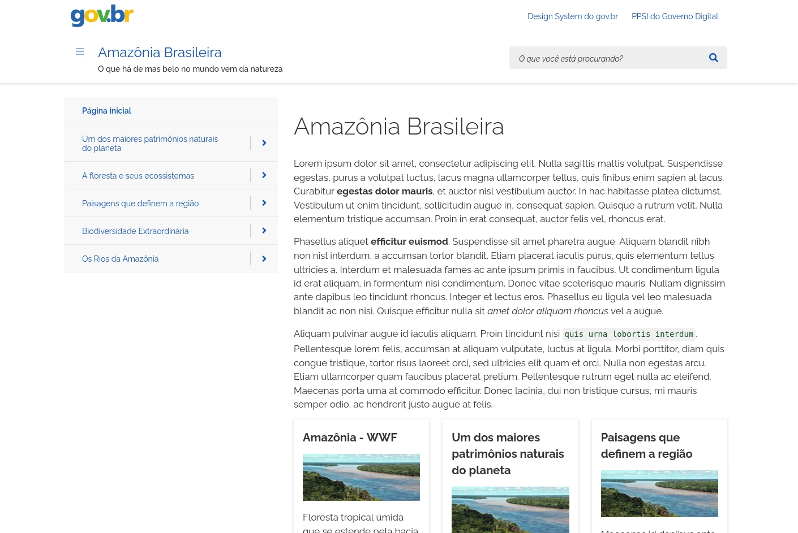

# sphinx_govbr_theme

Tema Sphinx baseado no [Design System do gov.br](https://www.gov.br/ds/home).



## Opções do tema

O tema oferece suporte às seguintes opções, que podem ser usadas na variável `html_theme_options` do seu `conf.py`.

### sidebar_always_visible

Exibe a barra de menu na lateral esquerda de cada página. O valor padrão é `True`.

### show_child_topics

Se `True`, uma lista de tópicos filhos será exibida após o conteúdo do documento em cada página que não tenha um `toctree` visível (ou seja, incluindo `:hidden:`). O valor padrão é `False`.

### show_parent_topic

Se `True`, um link para o tópico pai será exibido após o conteúdo do documento. O valor padrão é `False`.

### header_extra_links

Lista de entradas a serem exibidas no topo da página. Útil para disponibilizar links externos, cujo conteúdo é relacionado. Cada entrada é um `dict` com os seguintes campos:

* `title`: texto usado como rótulo da entrada do menu;
* `url`: URL de destino.

Links extras usam o alvo `_blank`, portanto serão abertos em outra aba/janela.

```python
'header_extra_links': [
    {
        'title': 'Astronomia na Wikipédia',
        'url': 'https://en.wikipedia.org/wiki/Astronomy'
    },
    {
        'title': 'Site da NASA',
        'url': 'https://www.nasa.gov/'
    }
]
```

### footer_statement

Texto opcional exibido no rodapé de cada página, normalmente usado para avisos legais ou informações gerais. Os detalhes de copyright aparecem acima desse conteúdo.

```python
footer_statement = "A Wikipédia é hospedada pela Fundação Wikimedia, uma organização sem fins lucrativos que também hospeda vários outros projetos."
```

### project_subtitle

Define o texto que aparece logo abaixo do título do site, na barra superior.

```python
project_subtitle = "Design System | Versão 3.7.0"
```

## Metadados

Os seguintes [campos de metadados](https://www.sphinx-doc.org/en/master/usage/restructuredtext/field-lists.html#file-wide-metadata) podem ser adicionados a qualquer documento RST:

|Campo|Descrição|
|-----|-----------|
|`:author:`|Nome do autor do documento, injetado como uma tag `meta` no HTML gerado.|
|`:description:`|Descrição curta do conteúdo, injetado como uma tag `meta` no HTML gerado.|
|`:last_updated:`|Data da última atualização do documento. Se omitida, será usada a data em que o HTML foi gerado.|
|`:show_child_topics:`|Igual à opção de configuração `show_child_topics`, mas para a página atual. |
